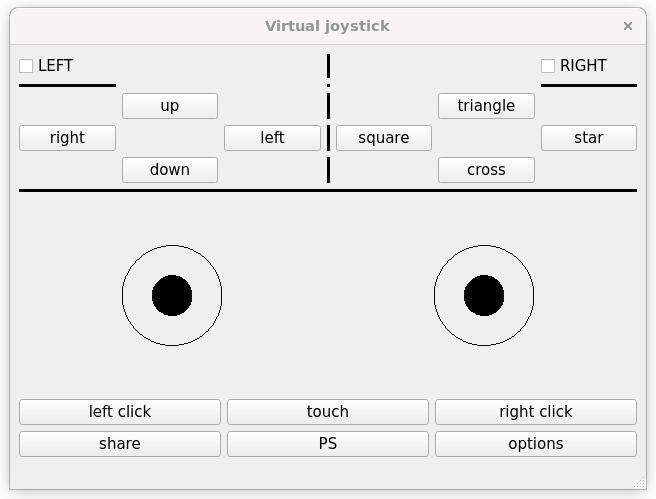

# Virtual Joystick ROS2 node
It is pretty common to use a joystick to teleoperate a robot. I'm using a PS4 controller but for some reason I can't figure out, it doesn't work reliable.
As I'm bored of trying to get it up and running, I build this simplified Qt GUI, which publishes sensor_msgs/joy messages to simulate a real joystick. 
By using this node, I can continue developing my robot in case PS4 controller fails once again.




## run the node
Use this command to launch the GUI

```console
ros2 launch virtual_joystick vjoy.launch.py
```

To operate the joysticks, just drag one of the circles using your mouse.

### Special thanks
I specially want to say thank you sampreets3 for this clear and complete example in how to use Qt and ROS2 together
[https://github.com/sampreets3/simple_gui/blob/main/simple_gui/gui_ros_node.py](https://github.com/sampreets3/simple_gui/blob/main/simple_gui/gui_ros_node.py)

I also want to say thanks to Dimirty Ernot for sharing a working joystick QWidget code here
[https://stackoverflow.com/questions/55876713/how-to-create-a-joystick-controller-widget-in-pyqt](https://stackoverflow.com/questions/55876713/how-to-create-a-joystick-controller-widget-in-pyqt)
